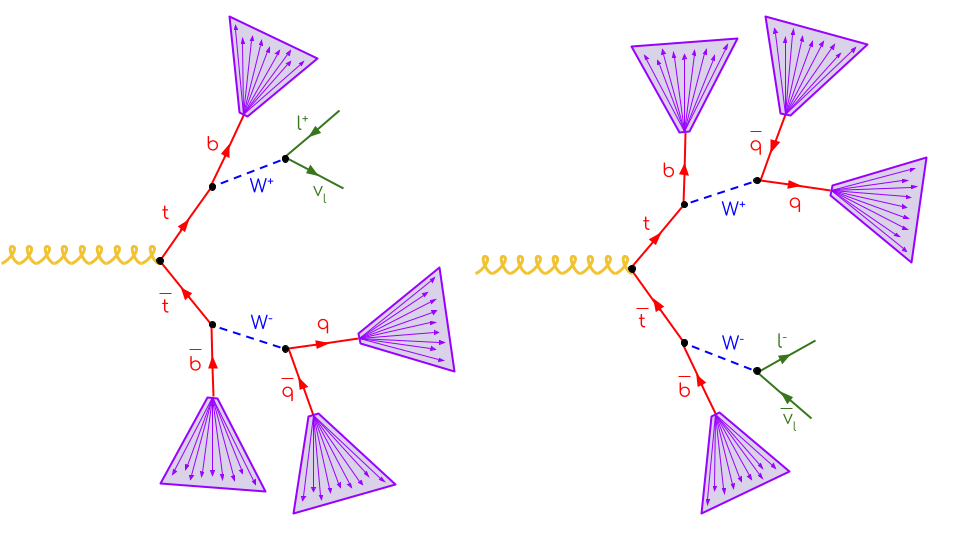
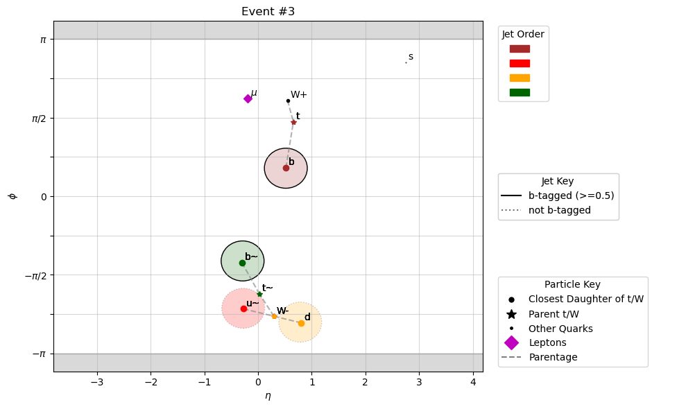

Task Background
============

CMS :math:`t\bar{t}` Cross-Section Measurement
-----------------
The Analysis Grand Challenge aims to demonstrate the integration of different software components in a realistic physics analysis. The task chosen for CMS open data is a measurement of the :math:`t\bar{t}` (top-antitop quark pair production) crosssection  measurement using events with at least four jets and one lepton in the final state. This signature has two possibilities, depending on whether the lepton/neutrino pair originates from the top or antitop quark:

The jets are illustrated in purple. These are collimated showers of hadrons resulting from quarks, which cannot exist on their own due to colour confinement.

Here is an example of the above signature in CMS Open Data. Since this is Monte Carlo simulated data, we can look at the particles that the jets originate from. The jets are plotted as circles in the :math:`\eta`-:math:`\phi` plane, and color-coordinated with the truth particles they are matched to. Note that :math:`\phi` is a circular variable, so the top of the graph matches to the bottom. The jets that are outlined in solid black are b-tagged, which means that they have properties which strongly indicate that they originate from bottom quarks.

  
The tree of the above event looks something like::

    g
    ├── t
    │   ├── W+
    │   │   ├── mu+
    │   │   └── nu(mu)
    │   └── b
    └── t~
        ├── W-
        │   ├── s
        │   └── c~
        └── b~
        
In CMS data, we have reconstructed jets and leptons, but we do not know with 100\% efficiency which particles the jets come from. Thus to minimize the number of background events in our signal region, we need to make some cuts using the kinematic properties of these variables. In this version of AGC, in the signal region (4j2b SR), we make the following cuts:

* Jet :math:`p_T \geq 25` GeV
* Electron :math:`p_T \geq 25` GeV
* Muon :math:`p_T \geq 25` GeV
* Exactly one lepton per event
* At least four jets per event
* At least two b-tagged jets per event

We also include a control region (4j1b CR) which has the same cuts as above, except that there is exactly one b-tagged jet per event.

